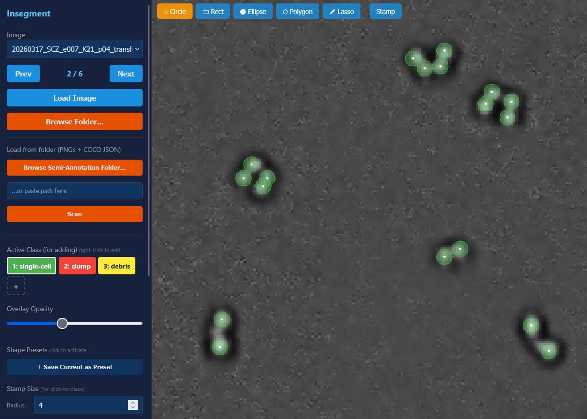
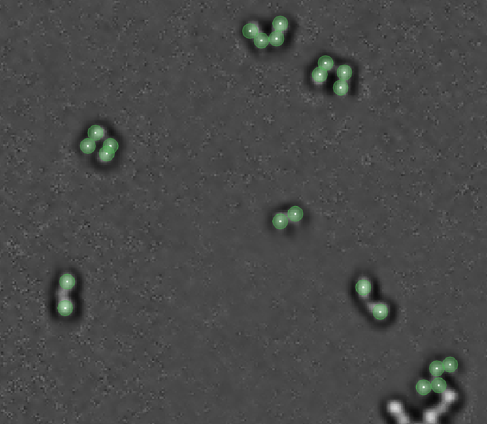
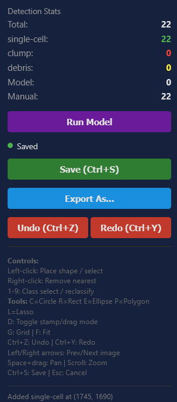
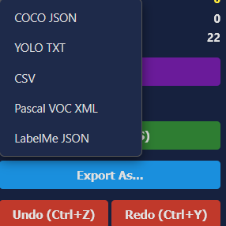

# Insegment

Interactive instance segmentation annotation tool. Load microscopy images (or any images), run a segmentation model, then correct the predictions with clicks -- add missed objects, remove false positives, reclassify, draw polygons.

Built for researchers who need fast, accurate annotations without the overhead of heavyweight labeling platforms.



## Features

- **Model-agnostic**: Plug in any instance segmentation model via a simple Python adapter
- **Click to correct**: Left-click to add, right-click to remove, 1/2/3 to reclassify
- **Polygon drawing**: Press P to draw freehand polygon annotations
- **Pan & zoom**: Shift+drag to pan, scroll to zoom, F to fit-to-screen
- **COCO JSON export**: Industry-standard format, compatible with most training pipelines
- **Semi-annotation mode**: Load existing COCO annotations and correct them
- **No model required**: Use without a model for pure manual annotation

## Install

```bash
pip install insegment
```

Or install from source:

```bash
git clone https://github.com/SergioCZ28/Insegment.git
cd Insegment
pip install -e .
```

## Quick Start

### Annotation-only mode (no model)

```bash
insegment serve --semiannotation-dir ./my_images
```

Where `my_images/` contains PNG files and an `_annotations.coco.json` file.

### With a model

```bash
insegment serve --model my_models:MySegmenter --checkpoint model.pth --image-dir ./data
```

Then open http://localhost:5000 in your browser.

## UI tour

**Click anywhere on a cell to drop a labelled annotation.** Shape tool and active class are set in the sidebar (default: circle, single-cell). Right-click a nearby annotation to delete it. Pan with Shift+drag, zoom with scroll.



The right-hand panel keeps running counts per class, separates **model** vs **manual** annotations so you can see how much correcting you're doing, and exposes the common actions:



Exports cover the formats most training pipelines consume:



## Writing a Model Adapter

Create a Python class that inherits from `BaseSegmenter`:

```python
from insegment.models import BaseSegmenter
from insegment.models.base import SegmentationResult
import numpy as np

class MySegmenter(BaseSegmenter):
    def __init__(self, checkpoint_path=None, **kwargs):
        # Load your model here
        self.model = load_my_model(checkpoint_path)

    def predict(self, image: np.ndarray) -> SegmentationResult:
        # Run inference -- return masks, boxes, classes, scores
        results = self.model(image)
        return SegmentationResult(
            masks=results.masks,       # (H, W) int array, 0=bg, 1..N=instances
            bboxes=results.boxes,      # (N, 4) array, [x1, y1, x2, y2]
            class_ids=results.classes,  # (N,) int array
            scores=results.scores,     # (N,) float array
        )

    @property
    def class_names(self) -> dict[int, str]:
        return {0: "cell", 1: "debris"}
```

Then run:

```bash
insegment serve --model my_module:MySegmenter --checkpoint model.pth
```

## Keyboard Shortcuts

| Key | Action |
|-----|--------|
| **1 / 2 / 3** | Set active class or reclassify selected annotation |
| **P** | Toggle polygon drawing mode |
| **G** | Toggle grid overlay |
| **F** | Fit image to screen |
| **Escape** | Deselect / cancel polygon |
| **Ctrl+S** | Save annotations |
| **Scroll** | Zoom in/out |
| **Shift+drag** | Pan |
| **Left-click** | Add annotation or select existing |
| **Right-click** | Remove nearest annotation |

## Export Formats

Pick a format from the **Export As...** menu, or hit `Ctrl+S` for the default (COCO JSON).

| Format | Output file | Notes |
|--------|-------------|-------|
| **COCO JSON** | `*_annotations.json` | Industry standard, category IDs are 1-indexed |
| **YOLO TXT** | `*_annotations.txt` | One line per bbox: `class cx cy w h` (normalized 0-1) |
| **CSV** | `*_annotations.csv` | Flat table with class name, bbox, and area |
| **Pascal VOC XML** | `*_annotations.xml` | Standard VOC detection format |
| **LabelMe JSON** | `*_labelme.json` | For round-tripping through the [labelme](https://github.com/wkentaro/labelme) tool; uses polygon segmentation data when available, falls back to rectangle from the bbox otherwise |

All exports are written to the output directory passed to `insegment serve` (default: current working directory).

## Roadmap

- [x] Customizable labels (rename, recolor, add/remove)
- [x] Multiple export formats (COCO, YOLO, CSV, VOC, LabelMe)
- [x] Annotation shapes (circle, rectangle, point, polygon)
- [x] Progress bar for model inference
- [x] Auto-save / persistence
- [ ] Dark mode
- [ ] Online learning (train while labelling)

## License

MIT
